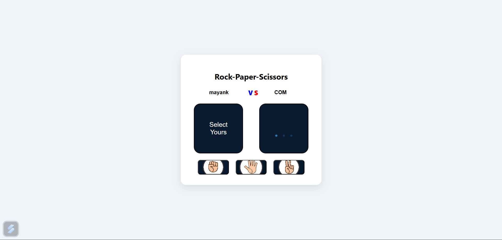

# ✊✋✌ Rock-Paper-Scissors Game

A simple and fun *Rock-Paper-Scissors* game built using *HTML, CSS, and JavaScript*. Challenge the computer and see who wins!

## 🔗 Live Demo

👉 [Play Now on Firebase Hosting](https://rock-paper-scissors-a9753.web.app/)

## 📸 Preview



## 🛠 Features

- User vs Computer gameplay
- Clean and responsive UI
- Click to choose Rock, Paper, or Scissors
- Randomized computer choices
- Result display with visual feedback

## 📂 Tech Stack

- HTML5
- CSS3
- JavaScript
- Firebase Hosting

## 🚀 Getting Started

To run this project locally:

```bash
# Clone the repository
git clone https://github.com/Mayank-301/rock-paper-scissors.git

# Navigate to the project directory
cd rock-paper-scissors

# Open index.html in your browser
